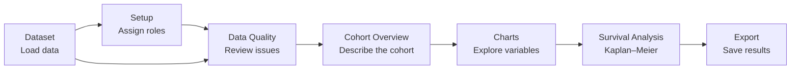

# Medical Dataset Explorer

A local Streamlit application for exploring patient-level medical tables.
It checks data quality, describes cohorts, and runs basic survival analyses.

[Full user and administrator guide](docs/USER_GUIDE.md)

> [!WARNING]
> Use this application only for exploratory research.
> It does not replace clinical judgment or a statistical analysis plan.

## Features

- Load CSV, TSV, TXT, and XLSX files.
- Detect delimiters, encodings, and column types.
- Preview data with highlighted missing values.
- Set the meaning and analysis role of each column.
- Check missing values, duplicates, ages, and dates.
- Find possible identifiers and sensitive data.
- Create cohort summaries and baseline characteristic tables.
- Create exploratory Plotly charts.
- Use a duration column or derive follow-up time from dates.
- Fit overall and grouped Kaplan–Meier curves.
- Run overall and pairwise log-rank tests.
- Apply the Holm correction to pairwise p-values.
- Create number-at-risk tables.
- Estimate survival at selected time points.
- Export CSV, JSON, HTML, PDF, PNG, and SVG files.

## Workflow



General data review and charts do not require a survival mapping.
Kaplan–Meier analysis and related exports require a confirmed mapping.

## Quick Start

### Requirements

- Python 3.10 or later.
- `pip`.
- A modern web browser.

### macOS or Linux

```bash
python3 -m venv venv
source venv/bin/activate
python -m pip install --upgrade pip
python -m pip install -r requirements.txt
streamlit run app.py
```

### Windows PowerShell

```powershell
py -m venv venv
.\venv\Scripts\Activate.ps1
python -m pip install --upgrade pip
python -m pip install -r requirements.txt
streamlit run app.py
```

Streamlit prints the application URL in the terminal.
The default URL is usually [http://localhost:8501](http://localhost:8501).

Press `Ctrl+C` in the terminal to stop the application.

## First Analysis

The repository includes two examples:

- `datasets/lung.csv`.
- `datasets/rossi.csv`.

Use the lung cancer cohort for the first walkthrough:

1. Open **Dataset**.
2. Expand **Try an example dataset**.
3. Select **Lung cancer cohort (recommended)**.
4. Select **Load example dataset**.
5. Open **Setup**.
6. Confirm the mapping below.

| Role | Value |
|---|---|
| Follow-up time | `time` |
| Event status | `status` |
| Event occurred | `1` |
| Censored | `0` |
| Time unit | `days` |
| Optional group | `sex` |

The confirmed mapping should produce:

- 228 usable rows.
- 165 events.
- 63 censored observations.

> [!IMPORTANT]
> Always verify event coding against the source data dictionary.
> The value `1` can have a different meaning in another dataset.

## Data Requirements

The application works best with patient-level or case-level tables.
One row should represent one independent analysis unit.

Suitable units include:

- A patient.
- A study participant.
- An admission.
- A clinical case.

Columns can contain:

- Demographic variables.
- Diagnoses.
- Treatments.
- Disease stages.
- Laboratory values.
- Biomarkers.
- Dates.
- Follow-up time.
- Event status.
- A de-identified ID.

### Supported Files

| Format | Extension | Notes |
|---|---|---|
| CSV | `.csv` | Comma, tab, semicolon, or pipe |
| TSV | `.tsv` | Tab-separated |
| Text table | `.txt` | Automatic delimiter detection |
| Excel | `.xlsx` | Worksheet selection |

Main limits:

| Limit | Value |
|---|---:|
| File size | 50 MB |
| Rows | 1,000,000 |
| Columns | 1,000 |
| Header length | 512 characters |

Each column must have a unique and non-empty name.

### Minimum Survival Schema

Use this format when the dataset contains a follow-up duration:

```csv
patient_id,followup_days,status,treatment,age
P001,365,death,A,67
P002,420,alive,B,59
P003,180,death,A,71
```

Use this format when the application must derive time from dates:

```csv
patient_id,index_date,event_date,last_followup_date,treatment
P001,2024-01-10,2024-08-04,2024-08-04,A
P002,2024-02-01,,2025-02-01,B
P003,2024-03-15,2024-09-20,2024-09-20,A
```

Use the `YYYY-MM-DD` format for dates.
The application rejects ambiguous date values.

## Application Pages

| Page | Purpose |
|---|---|
| **Dataset** | Load a file, review metadata, select a goal, and preview data |
| **Setup** | Confirm survival roles and edit column annotations |
| **Data Quality** | Review errors, warnings, and detailed checks |
| **Cohort Overview** | Review cohort metrics and create a baseline table |
| **Charts** | Create exploratory charts and review summary statistics |
| **Survival Analysis** | Apply filters, fit Kaplan–Meier curves, and run tests |
| **Export** | Download data, configuration, and combined reports |

## Charts

The **Charts** page supports:

- A histogram with a box plot.
- A bar chart.
- A box plot.
- A violin plot.
- A scatter plot.
- A time-series plot.
- A stacked bar chart.
- A correlation heatmap.
- A missingness chart.

The **Auto** mode selects a chart from the X and Y variable types.
Users can save each Plotly chart as PNG or SVG.

Users can also download standard exploratory charts as interactive HTML.

## Survival Analysis

The application uses `lifelines.KaplanMeierFitter`.

The survival page provides:

- An overall Kaplan–Meier curve.
- Grouped Kaplan–Meier curves.
- 95% confidence intervals.
- Censor marks.
- Cohort filters.
- An overall log-rank test.
- Pairwise tests for three to eight groups.
- Holm-adjusted p-values.
- Overall and grouped summaries.
- Number-at-risk tables.
- Survival estimates at selected time points.
- One-year, three-year, and five-year survival estimates.

The application estimates median follow-up with the reverse Kaplan–Meier method.
Year-based estimates require a known time unit and sufficient follow-up.

> [!NOTE]
> The log-rank test does not adjust for age, stage, or other confounders.
> Its result does not prove that a treatment caused an outcome.

## Exports

The **Export** page creates:

| File | Contents |
|---|---|
| `current_dataset.csv` | The current parsed dataset |
| `cleaned_mapped_data.csv` | Source columns and standardized survival roles |
| `analysis_configuration.json` | Survival mapping and column annotations |
| `medical_dataset_report.html` | A combined HTML table report |
| `medical_dataset_report.pdf` | A combined PDF table report |

The analysis table uses these internal columns:

| Column | Meaning |
|---|---|
| `_time` | Time to an event or censoring |
| `_event` | `1` for an event and `0` for censoring |
| `_id` | The patient ID |
| `_group` | The analysis group |

CSV export neutralizes text that can execute as a spreadsheet formula.

## Project Structure

```text
meddb_dashboard/
├── app.py
├── requirements.txt
├── README.md
├── .streamlit/
│   └── config.toml
├── datasets/
│   ├── lung.csv
│   ├── rossi.csv
│   └── stanford_heart_transplants.csv
├── docs/
│   └── USER_GUIDE.md
├── src/
│   ├── charts.py
│   ├── cohort_overview.py
│   ├── column_annotations.py
│   ├── data_loading.py
│   ├── data_quality.py
│   ├── exports.py
│   ├── profiling.py
│   ├── role_suggestions.py
│   ├── survival_analysis.py
│   ├── survival_mapping.py
│   ├── survival_plots.py
│   └── upload_state.py
└── tests/
```

## Architecture

| Module | Responsibility |
|---|---|
| `app.py` | Streamlit interface and session state |
| `src/data_loading.py` | File validation and loading |
| `src/profiling.py` | Missing-value normalization and column profiles |
| `src/column_annotations.py` | Column meanings and analysis roles |
| `src/data_quality.py` | Data-quality checks |
| `src/cohort_overview.py` | Cohort metrics and baseline tables |
| `src/charts.py` | Chart preparation and Plotly figures |
| `src/survival_mapping.py` | Survival mapping and validation |
| `src/survival_analysis.py` | Kaplan–Meier estimates and log-rank tests |
| `src/exports.py` | CSV, JSON, HTML, and PDF exports |

## Tests

Run the complete test suite:

```bash
venv/bin/python -m pytest
```

Use this command in an active virtual environment:

```bash
python -m pytest
```

Run the additional checks:

```bash
python -m compileall app.py src tests
git diff --check
```

## Privacy

The application does not provide authentication or access control.
Do not expose it to a public network without external protection.

Remove these fields before an upload:

- Names.
- Addresses.
- Phone numbers.
- Email addresses.
- Medical record numbers.
- Direct identifiers.
- Free text that can contain personal data.

The sensitive-column check uses heuristics.
It does not replace a separate privacy audit.

## Limitations

The current version does not include:

- Automatic data cleaning.
- Missing-value imputation.
- Cox regression.
- Competing-risk analysis.
- Recurrent-event analysis.
- Start-stop interval analysis.
- Causal inference.
- Persistent project storage.
- User accounts.
- A ready-to-use cloud deployment configuration.

The `datasets/stanford_heart_transplants.csv` file uses start-stop intervals.
Convert it to one analysis row per patient before you use this application.

## Documentation

The full guide includes:

- A detailed walkthrough.
- A description of every interface control.
- Data preparation rules.
- Kaplan–Meier and log-rank interpretation.
- Troubleshooting steps.
- Technical documentation.
- Analysis checklists.

Open [docs/USER_GUIDE.md](docs/USER_GUIDE.md).

## License

This repository does not currently grant a software license.
The author retains all rights unless a license is added later.
